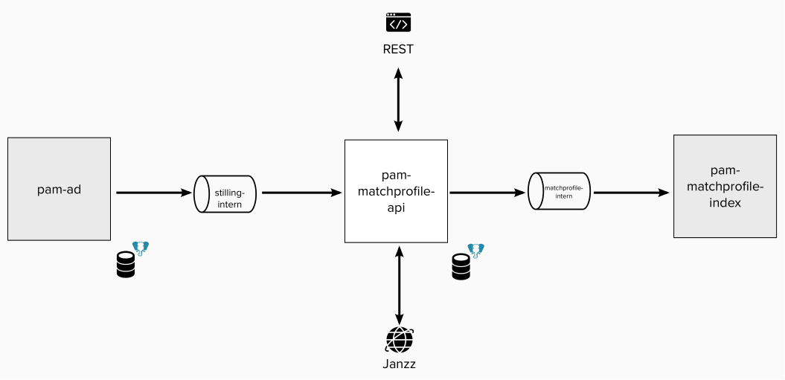

## Beskrivelse

pam-matchprofile-api er en applikasjon for å motta stillingsannonser fra Kafka og mappe dem til matchprofiler (stillingsannonse i Janzz-format) via parser hos Janzz. Matchprofilene tilgjengeliggjøres via REST API og Kafka.

Dette prosjektet er for å la jobbsøkere kunne bruke sin CV til å søke etter relevante stillinger basert på Janzz sin matchteknologi. Prosjektet er pågående og enda ikke tatt fullt i bruk. 

# Teknisk dokumentasjon

## Teknologier

* Kotlin
* Micronaut
* Postgres
* Kafka

## Systemlandskap

Bildet viser en forenklet teknisk skisse av pam-matchprofile-api og interne integrasjoner. 



### REST API

Appen har et REST API for å hente informasjon om matchprofiler.

### Integrasjon med pam-ad (Kafka)

[navikt/pam-ad](https://github.com/navikt/pam-ad) publiserer jobbannonser på Kafka-topicet `stilling-intern`. 
pam-matchprofile-api plukker opp annonser fra dette topicet og mapper dem til matchprofiler.

### Janzz

Janzz API brukes for å parse jobbannonser og berike matchprofiler med relaterte konsepter.

Mer informasjon om Janzz sitt API finner man i [Janzz´s API-dokumentasjon](https://www.janzz.jobs/static/doc/apiv1/index.html).

### Postgres DB

Appen lagrer matchprofiler i en Postgres-database.

### Integrasjon med pam-matchprofile-index (Kafka)

Appen publiserer matchprofiler på Kafka-topicet `matchprofile-intern`. 

[navikt/pam-matchprofile-index](https://github.com/navikt/pam-matchprofile-index) plukker matchprofiler fra 
dette topicet og indekserer profilene i OpenSearch. 

# Komme i gang

## Kjøre applikasjonen

Applikasjonen kan startes lokalt i terminal fra prosjektets rotmappe:

```
./gradlew run
```

Eventuelt kan man lage en `Micronaut`-konfigurasjon med Main class `no.nav.arbeidsplassen.matchprofile.Application`
i IntelliJ.

API-et eksponeres på port `8080`.

## Lokalt utviklingsmiljø

Lokalt utviklingsmiljø kan settes opp med `Docker`.

### API, Kafka og database

Start applikasjonen sammen med containere for Kafka og Postgres med følgende kommando fra prosjektets rotmappe:

```
docker compose up
```

API-et eksponeres via Docker-container på port `9090`.

### Indexer og OpenSearch

Appen kan startes sammen med [pam-matchprofile-index](https://github.com/navikt/pam-matchprofile-index) og 
OpenSearch ved å bruke Docker-profilen `index`. Bruk følgende kommandoer fra *root*:

```
docker compose --profile index up
```

OpenSearch Dashboard kan da åpnes i browser på `http://localhost:5601`

---

# Henvendelser

Spørsmål knyttet til koden eller prosjektet kan stilles som issues her på GitHub.
